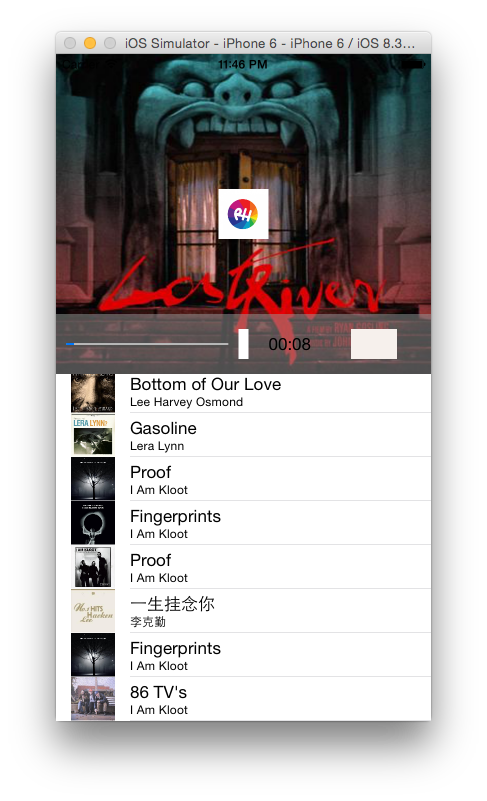
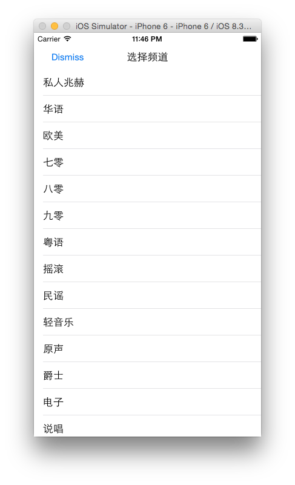

# KYDoubanFM

##纯Swift写的第三方豆瓣FM客户端

使用了两个豆瓣FM接口： 

*频道列表*
[http://www.douban.com/j/app/radio/channels](http://www.douban.com/j/app/radio/channels)
*歌曲列表*
[http://douban.fm/j/mine/playlist?channel=0](http://douban.fm/j/mine/playlist?channel=0)

复习了Swift如果使用网络请求和数据缓存，以及协议protocol的使用、MPMoviePlayerController的使用、以及加深了Swift语法的熟练程度。

分为两个VC：

第一个VC歌曲列表：显示的是当前频道的所有歌曲。

第二个VC是频道列表：列举有出了所有的频道。

点击第二个VC(也就是频道列表之后)，会跳转到第一个VC(也就是歌曲列表)，并且加载出选中频道的所有歌曲。

点击图片可以实现暂停播放、继续播放。并且实现了进度条和进度时间。

